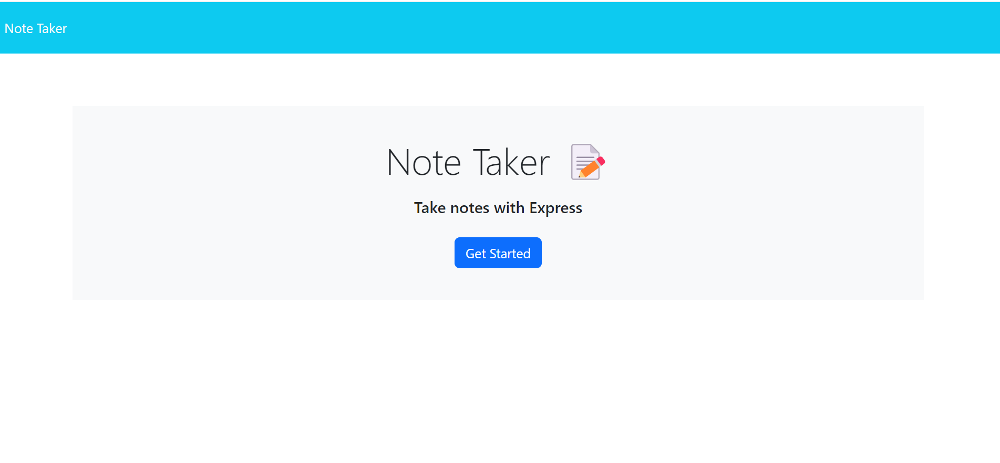
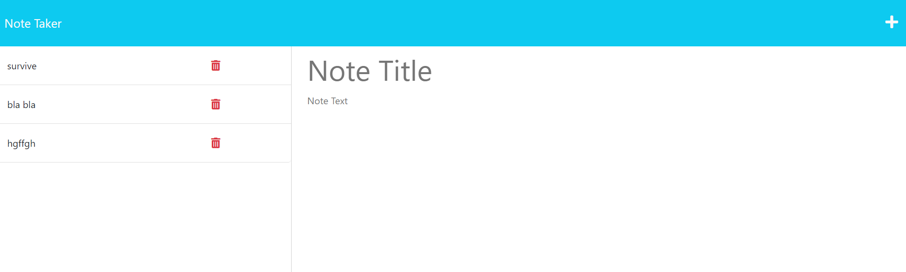
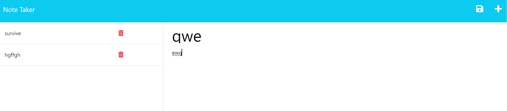
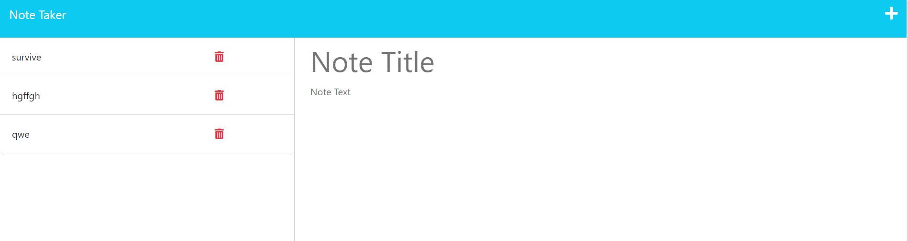
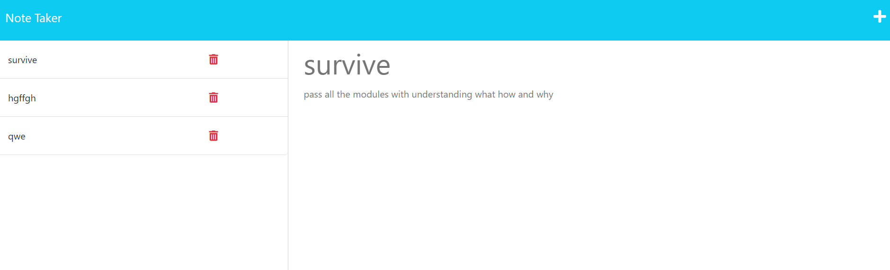
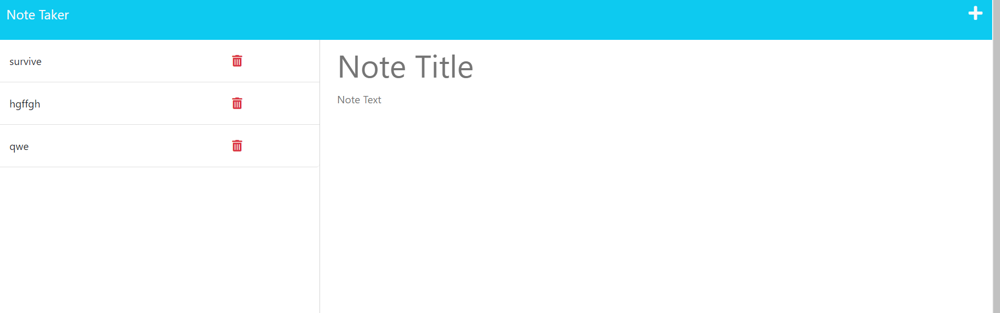
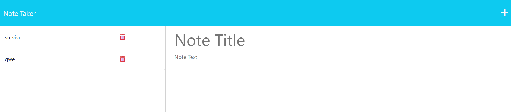

# Note Taker Starter Code

## Description 📖

An application called Note Taker that can be used to write and save notes. This application will use an Express.js back end and will save and retrieve note data from a JSON file.

The application’s front end has already been created.Developed the back-end of the application and connected beetwen.

# Deployed Application 🔥

https://dashboard.heroku.com/apps/note-take-ro

# User Story 📃

AS A small business owner
I WANT to be able to write and save notes
SO THAT I can organize my thoughts and keep track of tasks I need to complete

# Acceptance Criteria 🔍

WHEN I open the Note Taker
THEN I am presented with a landing page with a link to a notes page

WHEN I click on the link to the notes page
THEN I am presented with a page with existing notes listed in the left-hand column, plus empty fields to enter a new note title and the note’s text in the right-hand column

WHEN I enter a new note title and the note’s text
THEN a Save icon appears in the navigation at the top of the page

WHEN I click on the Save icon
THEN the new note I have entered is saved and appears in the left-hand column with the other existing notes

WHEN I click on an existing note in the list in the left-hand column
THEN that note appears in the right-hand column

WHEN I click on the Write icon in the navigation at the top of the page
THEN I am presented with empty fields to enter a new note title and the note’s text in the right-hand column

Application allows users to delete notes.

# Usage 🔌

npm i

node server.js

http://localhost:3001/

# Built With 🛠

# Author 👩‍💻

[][1]

[1]: https://github.com/poucoLouco

[][2]

[2]:https://www.linkedin.com/in/roksolana-odynak-25728025a

# License 📄

